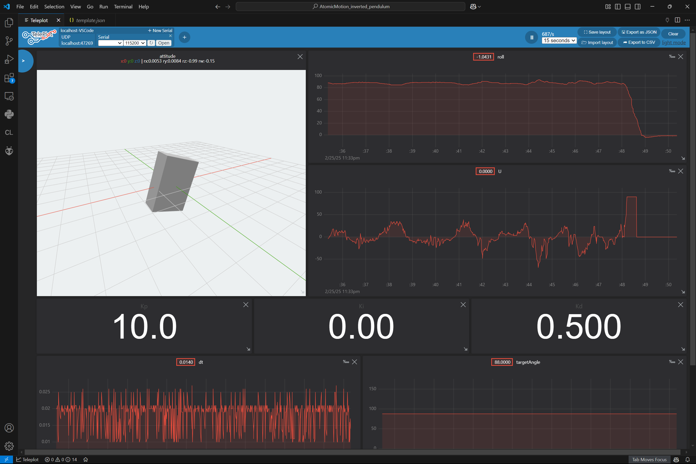

# クローラ型倒立振子

M5Stackの
[AtomS3](https://docs.m5stack.com/en/core/AtomS3)
と
[Atomic Motion Base](https://docs.m5stack.com/en/atom/Atomic%20Motion%20Base)
を使って製作したクローラ型のラジコンが倒立できるか実験してみた。

## 動作

### 倒立状態 (gif)

カーペットの上じゃないと立たない。
40~60秒くらいが限界。\
サーボの回転方向によって速度が異なるため、やや回転する。


### Teleplotによるデータの可視化

画面右上の ```Import layout``` から以下のjsonファイルを読み込むと同じ表示になる。\
[Teleplot テンプレート](teleplot\template.json)



## システム構成


## 部品

### Rover

* [AtomS3](https://docs.m5stack.com/en/core/AtomS3)
(マイコン, IMU)
* [Atomic Motion Base](https://docs.m5stack.com/en/atom/Atomic%20Motion%20Base)
(モータードライバ, バッテリー)
* [FS90R](https://www.feetechrc.com/48v-13kg-analog-continuous-rudder-machine.html)
(連続回転サーボ)
* [連結式クローラー&スプロケットセット](https://www.tamiya.com/japan/products/70237/index.html)
(履帯)

<table>
  <tr>
    <td></td>
    <td></td>
  </tr>
  <tr>
    <td></td>
    <td></td>
  </tr>
</table>

### Monitor (additional)

* [M5Stack Core2](https://docs.m5stack.com/en/core/core2)
* [M5Stack Module HMI](https://docs.m5stack.com/en/module/HMI%20Module)

<table>
  <tr>
    <td></td>
    <td></td>
  </tr>
</table>
